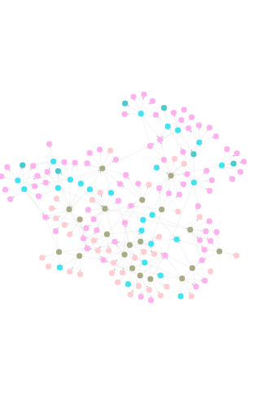

# KG-LLM: Proof-of-Concept

## Overview
This repository contains the first iteration of a knowledge graph leveraging Large Language Models (LLM) as a proof-of-concept. The project integrates with OpenAI's API and is planned to be switched to BLOOM. This system is designed to extract entities and relationships from various textual sources, including people profiles, project briefs, and Slack messages, and subsequently store this structured data in a Neo4J database. The aim is to create a comprehensive knowledge graph that offers insightful connections and associations.

## Key Features

**- OpenAI API Integration**: Utilizes OpenAI's powerful language models for extracting structured data from text.

**- Neo4J Database Connectivity**: Stores and manages the extracted data in a Neo4J graph database.

**- Flexible Data Processing**: Capable of handling multiple data types including project briefs, profiles, and messages.

**- Scalable Architecture**: Designed to be scalable with further improvements like dedicated GPU support.

## Installation and Setup

### 1. Clone the Repository:

```
git clone https://github.com/Quantolio/LLM.git
```

### 2. Install Python dependencies in a virtual environment:

```
python3 -m venv kgllm-venv
source kgllm-venv/bin/activate
pip3 install -r requirements.txt
```

### 3. Environment Setup:

- Create a .env file in the root directory.

- Add your OpenAI API key, Neo4J connection URL, username, and password to the .env file as follows:
```
OPENAI_API_KEY=your_openai_api_key
NEO4J_CONNECTION_URL=your_neo4j_connection_url
NEO4J_USER=your_neo4j_username
NEO4J_PASSWORD=your_neo4j_password
```

### 4. Run the notebook:
Execute the cells in **llm.ipynb** in order.


# Proof-of-Concept Visualization
Below is an example visualization of the output knowledge graph generated by this system:



Additionally, you can view the knowledge graph in its csv format in the **neo4j_query_table_data_2023-1-3.csv** file.

# Planned Enhancements
**- BLOOM Finetuning**: Future iterations will include finetuning on the BLOOM model for enhanced accuracy and efficiency. We are currently making API calls to OpenAI as a beta.

**- GPU Support**: Upgrading the system for dedicated GPU support to improve processing speeds.

**- Extended Neo4J Integration**: Further development of the database structure and querying capabilities.

# Contributions
Contributions to this project are welcome. Please follow the standard fork-and-pull request workflow.

*Onur Ozbek*  
*January 3, 2024*